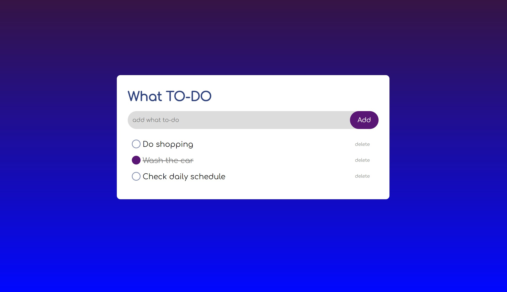
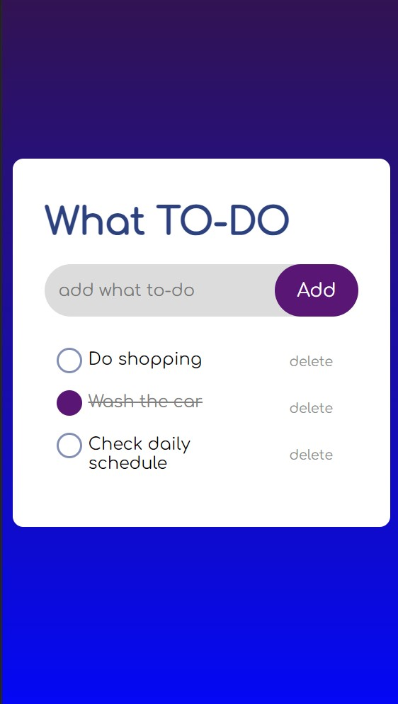

# To-Do App

A simple to-do app built using JavaScript that allows users to add new tasks, list their tasks, and delete completed tasks.

## Table of Contents

- [To-Do App](#to-do-app)
  - [Table of Contents](#table-of-contents)
  - [Links](#links)
  - [Features](#features)
  - [Screenshots](#screenshots)
  - [Continued Devolopment](#continue-devolopment)
  - [Author](#author)

## Links

Check out the live site here => [Click Here](https://ozlemxates.github.io/To-Do-App/)

## Features

- Add New Tasks: Users can enter a new task in the input field and click the "Add" button to add it to the to-do list.

- List tasks: All tasks are displayed as list items, allowing users to view their tasks at a glance.

- Mark tasks as completed: By clicking on a task, it will be marked as completed with a line-through effect.

- Delete tasks: Each task has a "Delete" button next to it, allowing users to remove completed tasks from the list.

- Local Storage: The app utilizes local storage to save tasks, ensuring they remain available even if the page is refreshed.

## Screenshots

## Continued Devolopment
Thank you for checking out our To-Do List App! I have some plans for the future development of this project, including improvements to the UI/UX, bug fixes, and performance enhancements.

## Author
GitHub Profile => [Here](https://github.com/ozlemxates)

Frontend Mentor Profile => [Here](https://www.frontendmentor.io/profile/ozlemxates)